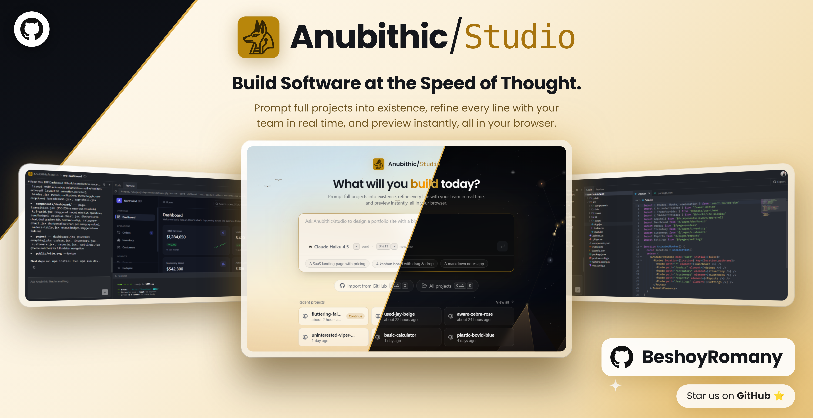

<div align="center">



# 𓃣 Anubithic Studio

**A browser-based AI IDE: describe an app, watch an agent build it file by file, run it live in the browser, and ship it to GitHub.**

<p>
  
  
  
  
  
  
  
  
  
  
</p>

</div>

---

## 📖 Overview

Anubithic Studio is a Replit / Lovable-style IDE that runs entirely in the browser. It has a VS Code-style file explorer, a CodeMirror editor with inline AI, an **agentic chat that reads and edits your project files**, a **live preview and terminal powered by WebContainers**, and **GitHub import/export**. Type a prompt on the home page and you get a new project, a conversation, and an agent already writing the code. The files show up in your editor as they are written.

The agent runs in the background as durable Inngest jobs. Every file it creates, edits, renames or deletes is a Convex mutation, so the explorer, the open tabs and your teammates' screens all update in real time with no polling and no refresh.

AI runs on **your own key (Bring Your Own Key)**. You pick one model (Claude, GPT, Gemini, or a local Ollama model) and it drives every AI feature. Keys are verified against the provider, encrypted with AES-256-GCM, and never sent back to the browser.

**Design:** The look is built around the Anubis mark, with an animated logo loader, a day/night home scene, and full **dark, light and system** theming that also applies to the editor, the terminal and the canvas.

---

## ✨ Features

### 🤖 AI Coding Agent

- **Prompt-to-project**: describe an app on the home page and a new project (with a generated name) and conversation are created, with the agent already running
- **Agent tools**: the agent lists, reads, creates, updates, renames and deletes files, creates folders, and scrapes URLs
- **Live edits**: every tool call is a Convex mutation, so changes appear in your editor as the agent makes them
- **Step-by-step progress**: tool activity streams into the chat as steps ("Scanning project files...", running / done / error)
- **Cancel anytime**: stop a running agent mid-task
- **Auto-titled conversations**: a small secondary agent names each conversation from its first message
- **Conversation history**: multiple conversations per project, with a history dialog and delete support
- **Rich chat rendering**: Markdown, syntax-highlighted code, math, Mermaid diagrams and CJK text
- **Docs from the web**: URLs in a prompt are scraped with Firecrawl and fed to the model as context

### ✍️ AI in the Editor

- **Inline suggestions**: ghost-text completions while you type, accepted with `Tab`
- **Quick Edit** (`⌘/Ctrl + K`): select code, describe the change, and the model rewrites the selection in place
- **Selection toolbar**: "Quick Edit" or "Add to Chat" on any selection
- **URL-aware**: quick edits and suggestions also pull in scraped docs for any link in the instruction

### 🔑 Bring Your Own Key (BYOK)

- **One model drives everything**: the model you pick powers the agent, quick edit and suggestions
- **Supported models**: Claude Opus 5.5 / Sonnet 5 / Haiku 4.5, GPT-5.5 / GPT-5.4 mini, Gemini 3.8 Flash. Each one passed a live multi-turn tool-calling test with the agent.
- **Local models**: connect your own **Ollama** instance; the app reads the model's capabilities and recommends tool-capable coding models by memory size
- **Verified before saving**: keys are tested against the provider first
- **Encrypted at rest**: AES-256-GCM with a versioned keyring and key-rotation script; only the last 4 characters are ever shown
- **Scoped agent access**: the agent never sees your key. It calls a server proxy with a short-lived signed token bound to you, the model, the project and the run.
- **Rate limits & output caps** on every AI route, plus an audit log of key changes
- **Public security page** at `/security` explaining how keys are handled

### 🖥️ IDE & Editor

- **CodeMirror 6 editor**: JavaScript/TypeScript, HTML, CSS, JSON, Markdown, Python and Java, with minimap, indentation markers and format shortcut (`Shift + Alt + F`)
- **Tabs**: VS Code-style tabs, including preview tabs, with breadcrumbs for the active file
- **Resizable layout**: chat, explorer, editor and preview panes
- **Auto-reveal**: the explorer expands to and highlights whichever file is active
- **Theme-aware**: editor and terminal switch with the app theme

### 📁 File Explorer

- **Full file tree**: create, rename and delete files and folders inline
- **Drag and drop**: move files and folders around the tree
- **Binary file support**: images and other binaries are kept in Convex file storage
- **File-type icons** for every common extension

### ▶️ Live Preview & Terminal

- **WebContainers**: runs Node.js in the browser, so `npm install` and `npm run dev` happen on the client
- **Live preview**: the dev server's URL loads in an embedded preview and reloads on changes
- **Integrated terminal**: xterm.js showing install and dev-server output
- **Configurable commands**: the install and dev commands can be changed per project

### 🐙 GitHub Import & Export *(Pro)*

- **Import any repo**: pull a GitHub repository into a new project; text and binary files are both kept
- **Export to a new repo**: push a project to a new public or private repo with a description
- **Background jobs with status**: import/export run in Inngest with live status in the UI, and export can be cancelled
- **Uses your GitHub login**: OAuth tokens come from Clerk, with no separate GitHub setup

### 👥 Team Collaboration *(Pro)*

- **Invite by email**: invite people who haven't signed up yet; they claim the invite when they sign in
- **Roles**: owner > admin > contributor, checked on every server call
  - Contributors edit files and chat with the agent
  - Admins can also rename, export and manage contributors
  - Only the owner can delete the project or promote/demote admins
- **Live presence**: a VS Code-style status bar shows who is in the project and which file each person has open. Click a teammate to follow them to their file.
- **Shared projects** appear in each member's project list

### 🏠 Projects & Home

- **Home page**: prompt box, recent-projects grid and a day/night scene
- **Command palette** (`⌘/Ctrl + K`): search and jump between projects
- **Keyboard shortcuts**: `⌘/Ctrl + I` import from GitHub, `⌘/Ctrl + J` focus the prompt
- **Rename & delete** projects and conversations, with confirmation
- **Custom 404 and error pages**

### 🔐 Platform

- **Clerk authentication** with social login (including GitHub)
- **Clerk Billing**: Pro-plan gates enforced on the server; the UI updates without a reload when the plan changes
- **Three trust zones**: browser → Convex (user auth), browser → route handlers (Clerk), server → Convex (internal key)
- **Error tracking**: Sentry with body, prompt and secret scrubbing, tunneled through `/monitoring`
- **Fail-closed startup**: production refuses to boot if any security secret is missing or malformed
- **Security test suite**: Vitest + convex-test covering encryption, proxy tokens, logging and shared-project access

---

## 🧰 Tech Stack

| Layer | Technology |
| :--- | :--- |
| **Framework** | Next.js 16 (App Router, Turbopack) |
| **Language** | TypeScript 5 (strict) |
| **UI** | React 19, Tailwind CSS 4, shadcn/ui, Radix UI, Base UI, Lucide, Motion |
| **Database & backend** | Convex (reactive database, server functions, file storage) |
| **Auth & billing** | Clerk (auth, Clerk Billing, GitHub OAuth tokens) |
| **Background jobs** | Inngest (durable steps, cancellation, concurrency) |
| **AI agent** | `@inngest/agent-kit` (multi-tool agent network) |
| **AI models** | Vercel AI SDK: Anthropic, OpenAI, Google Gemini, Ollama |
| **Web scraping** | Firecrawl |
| **Editor** | CodeMirror 6 + minimap, indentation markers |
| **Runtime preview** | WebContainers + xterm.js |
| **GitHub** | Octokit |
| **Chat UI** | AI Elements, Streamdown, Shiki |
| **State** | Zustand (editor tabs, file-tree expansion) |
| **Forms & validation** | TanStack Form, React Hook Form, Zod 4 |
| **Monitoring** | Sentry |
| **Testing** | Vitest, convex-test |

---

## 🚀 Getting Started

### 1. Prerequisites

- **Node.js** ≥ 20 and npm
- Accounts for **Convex**, **Clerk**, **Inngest**, **Firecrawl** and **Sentry**
- An API key from at least one AI provider (Anthropic, OpenAI or Google), **or** a local [Ollama](https://ollama.com) install

### 2. Clone and install

```bash
git clone https://github.com/BeshoyRomany/anubithic-studio.git
cd anubithic-studio
npm install
```

### 3. Environment variables

Create a `.env.local` file in the project root:

```bash
# App (public https URL; the agent's AI proxy is served from here)
APP_URL=https://localhost:3001

# Convex (written for you by `npx convex dev`)
CONVEX_DEPLOYMENT=
NEXT_PUBLIC_CONVEX_URL=

# Clerk
NEXT_PUBLIC_CLERK_PUBLISHABLE_KEY=
CLERK_SECRET_KEY=
CLERK_JWT_ISSUER_DOMAIN=

# Server → Convex (also set on the Convex deployment)
ANUBITHIC_STUDIO_CONVEX_INTERNAL_KEY=

# BYOK security (generate each with: openssl rand -base64 32)
AI_KEYS_ENCRYPTION_KEY=
AI_PROXY_TOKEN_SIGNING_KEY=
AI_CREDENTIALS_CONVEX_KEY=        # also set on the Convex deployment

# Firecrawl
FIRECRAWL_API_KEY=

# Sentry
SENTRY_AUTH_TOKEN=

# Inngest (required in production)
INNGEST_EVENT_KEY=
INNGEST_SIGNING_KEY=

# Dev only: fall back to the app's own provider keys
# AI_ALLOW_ENV_KEYS=true
# ANTHROPIC_API_KEY=
# OPENAI_API_KEY=
# GOOGLE_API_KEY=
```

Set `CLERK_JWT_ISSUER_DOMAIN`, `ANUBITHIC_STUDIO_CONVEX_INTERNAL_KEY` and `AI_CREDENTIALS_CONVEX_KEY` on the **Convex deployment** as well:

```bash
npx convex env set ANUBITHIC_STUDIO_CONVEX_INTERNAL_KEY <value>
```

> **⚠️ Clerk:** enable **GitHub** as a social connection (with `repo` scope) for import/export, and create a **`pro`** plan in Clerk Billing to unlock the Pro features.

> **⚠️ Encryption key:** never change `AI_KEYS_ENCRYPTION_KEY` by hand once keys are stored. Follow the rotation runbook in [`docs/security/byok.md`](./docs/security/byok.md).

### 4. Start the backend

```bash
npx convex dev
```

### 5. Run it

Each in its own terminal:

```bash
npm run dev                      # Next.js on https://localhost:3001
npx inngest-cli@latest dev       # Inngest dev server (agent, import, export)
```

Open **https://localhost:3001** in your browser.

> **⚠️ HTTPS:** the dev server runs with `--experimental-https` using the self-signed `localhost+1*.pem` certificates in the repo root. WebContainers need a secure, cross-origin-isolated context, so plain `http://localhost:3000` won't work.

Then open the model picker, add your API key (or connect Ollama), and start prompting.

---

## 📜 Scripts

| Command | Description |
| :--- | :--- |
| `npm run dev` | Start the Next.js dev server over HTTPS on port 3001 |
| `npm run build` | Production build |
| `npm run start` | Serve the production build |
| `npm run lint` | Run ESLint |
| `npm test` | Run the Vitest + convex-test security suite |
| `npm run ai:check` | Live-test the registered models against their providers |
| `npm run ai:rotate-keys` | Re-encrypt stored AI keys under a new encryption key |
| `npx convex dev` | Run and sync the Convex backend |
| `npx inngest-cli@latest dev` | Local Inngest dev server for background jobs |

---

## 🏗️ Architecture

### Modular by feature

Every feature is self-contained: its UI, hooks, store, prompts and background jobs live together:

```
src/
├── app/                        # Routes only — pages delegate to features
│   ├── page.tsx                # Home: prompt, recent projects
│   ├── projects/[projectId]/   # The IDE
│   ├── invites/[inviteId]/     # Accept a team invite
│   ├── security/               # Public BYOK security page
│   └── api/                    # messages, quick-edit, suggestion, ai-keys, ai-local,
│                               # ai-proxy, github/{import,export}, projects, inngest
├── features/<feature>/         # auth · projects · editor · conversations · preview · ai
│   ├── views/ components/ hooks/ layouts/ store/
│   ├── extensions/             # CodeMirror extensions (editor)
│   ├── prompts/ server/        # prompt sections, key crypto, proxy (ai)
│   └── inngest/                # background functions + agent tools
├── components/ui/              # shadcn/ui primitives
├── components/ai-elements/     # Chat UI blocks
├── inngest/client.ts           # Shared Inngest client
├── lib/                        # Convex HTTP client, Firecrawl, rate limit, Sentry scrub
└── proxy.ts                    # Clerk middleware
convex/                         # Schema + public API, auth helpers, system (server-only) API
tests/                          # Vitest + convex-test security tests
docs/security/byok.md           # BYOK design, runbook and threat model
```

### The agent pipeline

```
User sends a message → POST /api/messages (Clerk auth + role check)
   → placeholder assistant message written to Convex (status: processing)
   → Inngest event  message/sent
   → agent-kit network runs (≤ 20 turns) on the sender's model and key
        ↳ each tool call → Convex mutation → editor updates live
        ↳ each step appended to messages.steps → progress in the chat
   → final answer written, status: completed   (or cancelled via message/cancel)
```

Route handlers never do the long work. They validate with Zod, write a placeholder row, emit an event and return. Every side effect inside the job is a `step.run`, config errors throw `NonRetriableError`, and `onFailure` always writes a terminal status so the UI never spins forever. GitHub import (`github/import.repo`) and export (`github/export.repo`, cancellable) follow the same pattern.

### Three trust zones

1. **Browser → Convex:** public queries/mutations authenticate with `verifyAuth` and check project roles with `verifyProjectAccess`.
2. **Browser → Next.js route handlers:** guarded by Clerk's `auth()`, and they check the caller's project role before acting.
3. **Server → Convex:** Inngest functions and route handlers have no user identity, so `convex/system.ts` functions require an internal key. The browser never calls them.

### How the agent uses your key without seeing it

agent-kit model calls are executed by Inngest's servers, so they can't hold your provider key. Instead the model points at `/api/ai-proxy/[provider]/…` with a **5-minute signed capability** bound to user + provider + model + project + run. The proxy checks it against Convex (the run is still processing, you are still a member, the replay budget is not used up), decrypts your key for that one request, enforces rate and output-token limits, and replaces provider error bodies before anything is logged.

### Realtime updates

Nothing is polled. Chat messages, agent steps, file contents, import/export status and teammate presence are all Convex queries. When the database changes, every subscribed client re-renders, so the UI always matches the database.

---

## 📄 License

Released under the MIT License.

---

<div align="center">

**Built by [Beshoy Romany](https://github.com/BeshoyRomany)**

⭐ If you find this project useful, consider giving it a star!

</div>
